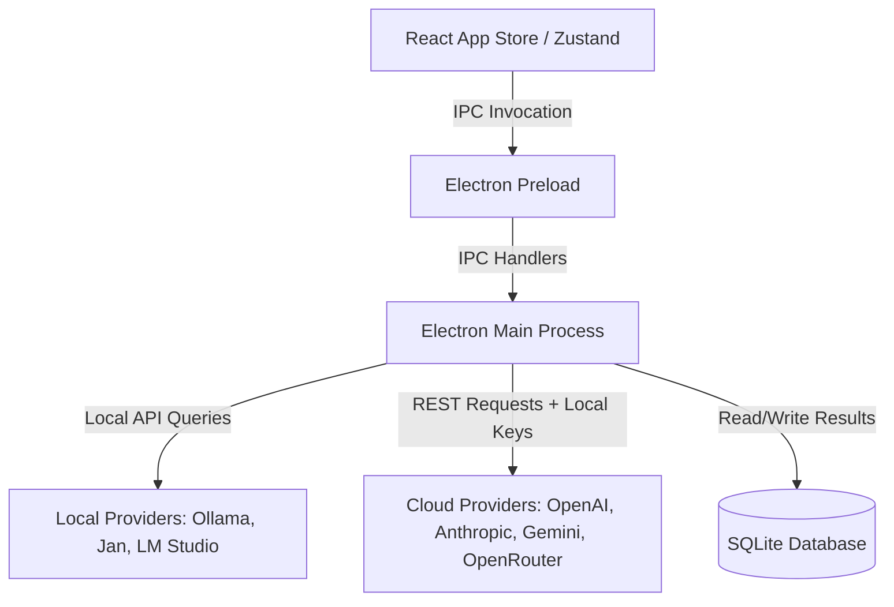

<h1 align="center">LocalBench ⚡</h1>

<p align="center">
  <b>The Professional Offline-First Local LLM Benchmark & Playground Tool</b>
</p>

<p align="center">
  The ultimate desktop application to evaluate, profile, and compare LLM execution speeds and reasoning scores on your own hardware.
</p>

<p align="center">
  <a href="https://github.com/satiricalguru/LocalBench/blob/main/LICENSE"></a>
  
  
  
  
  
  
</p>

<p align="center">
  <a href="https://github.com/satiricalguru/LocalBench/releases/tag/v1.0.0"><b>Download v1.0.0</b></a> · 
  <a href="#-key-features">Features</a> · 
  <a href="#-getting-started">Quick Start</a> · 
  <a href="#%EF%B8%8F-tech-stack--architecture">Architecture</a> · 
  <a href="#-packaging--release-builds">Packaging</a> · 
  <a href="#-running-validation-tests">Testing</a>
</p>

<hr />

## 📥 Download LocalBench

Get the official installer for your operating system:

| Platform | Download Link | Package Format | Architecture |
| :--- | :--- | :--- | :--- |
| 🍏 **macOS (Apple Silicon)** | [**Download for Mac (ARM64)**](https://github.com/satiricalguru/LocalBench/releases/download/v1.0.0/LocalBench-1.0.0-arm64.dmg) | `.dmg` installer | Apple Silicon (M1/M2/M3/M4) |
| 🍏 **macOS (Intel)** | [**Download for Mac (x64)**](https://github.com/satiricalguru/LocalBench/releases/download/v1.0.0/LocalBench-1.0.0.dmg) | `.dmg` installer | Intel Processors |
| 🪟 **Windows** | [**Download for Windows**](https://github.com/satiricalguru/LocalBench/releases/download/v1.0.0/LocalBench.Setup.1.0.0.exe) | `.exe` installer | Intel x64 / ARM64 |

---

## 🚀 Key Features

### 💻 1. Intelligent Hardware Matchmaker
No more guessing whether a model will fit in your memory or crash your device.
- **Unified Memory Analysis**: Deep hardware inspection for **Apple Silicon** (Unified Memory limits) and **Windows/Intel** platforms (Dedicated GPU VRAM).
- **Suitability Categorization**: Flags models dynamically as **Butter** (comfortably fits), **Struggle** (CPU offloading, resource bottleneck), or **Unrecommended** (will swap or crash).
- **Direct Library Integration**: Browse, pull (with live layer-by-layer download progress metrics), and delete models directly from **Ollama** within the UI.
- **Auto-Sync Registry**: Newly downloaded models automatically populate selectors across the application in real-time.

### ⏱️ 2. Sequential Multi-Model Queue
Evaluating multiple local models concurrently thrashing your GPU, skewing your benchmark scores, or triggering Out-of-Memory (OOM) errors. LocalBench runs custom evaluation runs sequentially, model-by-model, while tasks within a single model can execute concurrently for optimized speed profiling.

### ☁️ 3. Integrated Cloud Baselines
Safely test local outputs against frontier baselines like **GPT-4o**, **Claude 3.5 Sonnet**, and **Gemini 1.5 Pro**.
- **Secure Key Storage**: API credentials reside exclusively on the client-side `localStorage` and are only injected during active requests.
- **OpenRouter Integration**: Access thousands of open-source models hosted in the cloud.

### 🎭 4. Comparative Playground Sandbox
Compare responses side-by-side (up to 3 models concurrently).
- **Real-Time Streaming**: Stream outputs from both local runners and cloud APIs.
- **Live Performance Metrics**: Tracks and displays **Time to First Token (TTFT)**, **Tokens Per Second (TPS)**, and total duration for each model's response.

### 📊 5. Dynamic Scorer Heuristics Engine
Evaluates response quality using flexible, layout-insensitive scoring algorithms:
- **Speed (TPS)**: Pure velocity measurement.
- **Reasoning (Logic/Math)**: Deductive multi-turn verification.
- **Syllogisms**: Sequenced logical extraction (insensitized to markdown headers or numbering formatting).
- **Coding**: Identifies Python docstrings, asserts, syntax structures, and specific bug fixes.
- **Translation**: Cross-lingual comparison.
- **Creative Writing**: Verifies syllable distributions and structural counts (e.g. Haiku checks).

---
## 📷 Screenshots


---

## 🛠️ Tech Stack & Architecture



- **Frontend**: React 18, Zustand (State Management), TailwindCSS, Recharts (Data Visualization), Lucide React.
- **Backend (Electron)**: Main process IPC router, SQLite cache database for test historical data, Child process spawn wrappers (`ollama pull` streaming).
- **Bundler**: Vite + TypeScript.

---

## 🏁 Getting Started

### Prerequisites
1. [Node.js](https://nodejs.org/) (v18+ recommended)
2. [Ollama](https://ollama.com/) running locally (optional, but highly recommended for local models)

### Install Dependencies
```bash
npm install
```

### Start Development Server
This will compile the Electron main process, start the Vite server, and spin up the Desktop window.
```bash
npm run dev
```

---

## 📦 Packaging & Release Builds

Build target packages for production deployment:

### Build for macOS
```bash
npm run build:mac
```

### Build for Windows
```bash
npm run build:win
```

*Packaged applications will be exported into the `./dist` directory.*

---

## 🧪 Running Validation Tests

Ensure all scorers and pulling utilities are fully tested:
```bash
npm test
```
