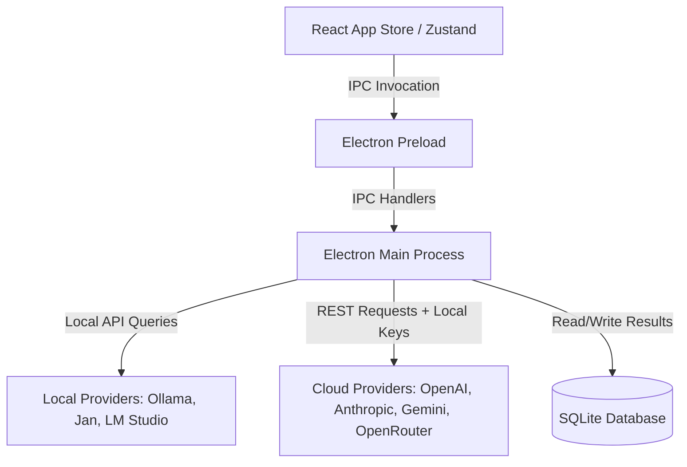

# ✨ LocalBench

> **The Professional Offline-First Local LLM Benchmark & Playground Tool**

LocalBench is a premium, developer-centric developer tool for testing, comparing, and profiling Large Language Models locally. Designed to resolve the core friction points of local model evaluations—such as VRAM memory collisions, rigid scoring, and lack of cloud baselines—LocalBench offers a unified, polished interface built on **Electron**, **React**, **TypeScript**, and **TailwindCSS**.

---

## 🚀 Key Features

### 💻 1. Intelligent Hardware Matchmaker
No more guessing whether a model will fit in your memory or crash your device.
- **Unified Memory Analysis**: Deep hardware inspection for **Apple Silicon** (Unified Memory limits) and **Windows/Intel** platforms (Dedicated GPU VRAM).
- **Suitability Categorization**: Flags models dynamically as **Butter** (comfortably fits), **Struggle** (CPU offloading, resource bottleneck), or **Unrecommended** (will swap or crash).
- **Direct Library Integration**: Browse, pull (with live layer-by-layer download progress metrics), and delete models directly from **Ollama** within the UI.
- **Auto-Sync Registry**: Newly downloaded models automatically populate selectors across the application in real-time.

### ⏱️ 2. Sequential Multi-Model Queue
Evaluating multiple local models concurrently thrashing your GPU, skewing your benchmark scores, or triggering Out-of-Memory (OOM) errors. LocalBench runs custom evaluation runs sequentially, model-by-model, while tasks within a single model can execute concurrently for optimized speed profiling.

### ☁️ 3. Integrated Cloud Baselines
Safely test local outputs against frontier baselines like **GPT-4o**, **Claude 3.5 Sonnet**, and **Gemini 1.5 Pro**.
- **Secure Key Storage**: API credentials reside exclusively on the client-side `localStorage` and are only injected during active requests.
- **OpenRouter Integration**: Access thousands of open-source models hosted in the cloud.

### 🎭 4. Comparative Playground Sandbox
Compare responses side-by-side (up to 3 models concurrently).
- **Real-Time Streaming**: Stream outputs from both local runners and cloud APIs.
- **Live Performance Metrics**: Tracks and displays **Time to First Token (TTFT)**, **Tokens Per Second (TPS)**, and total duration for each model's response.

### 📊 5. Dynamic Scorer Heuristics Engine
Evaluates response quality using flexible, layout-insensitive scoring algorithms:
- **Speed (TPS)**: Pure velocity measurement.
- **Reasoning (Logic/Math)**: Deductive multi-turn verification.
- **Syllogisms**: Sequenced logical extraction (insensitized to markdown headers or numbering formatting).
- **Coding**: Identifies Python docstrings, asserts, syntax structures, and specific bug fixes.
- **Translation**: Cross-lingual comparison.
- **Creative Writing**: Verifies syllable distributions and structural counts (e.g. Haiku checks).

---

## 🛠️ Tech Stack & Architecture



- **Frontend**: React 18, Zustand (State Management), TailwindCSS, Recharts (Data Visualization), Lucide React.
- **Backend (Electron)**: Main process IPC router, SQLite cache database for test historical data, Child process spawn wrappers (`ollama pull` streaming).
- **Bundler**: Vite + TypeScript.

---

## 🏁 Getting Started

### Prerequisites
1. [Node.js](https://nodejs.org/) (v18+ recommended)
2. [Ollama](https://ollama.com/) running locally (optional, but highly recommended for local models)

### Install Dependencies
```bash
npm install
```

### Start Development Server
This will compile the Electron main process, start the Vite server, and spin up the Desktop window.
```bash
npm run dev
```

---

## 📦 Packaging & Release Builds

Build target packages for production deployment:

### Build for macOS
```bash
npm run build:mac
```

### Build for Windows
```bash
npm run build:win
```

*Packaged applications will be exported into the `./dist` directory.*

---

## 🧪 Running Validation Tests

Ensure all scorers and pulling utilities are fully tested:
```bash
npm test
```
